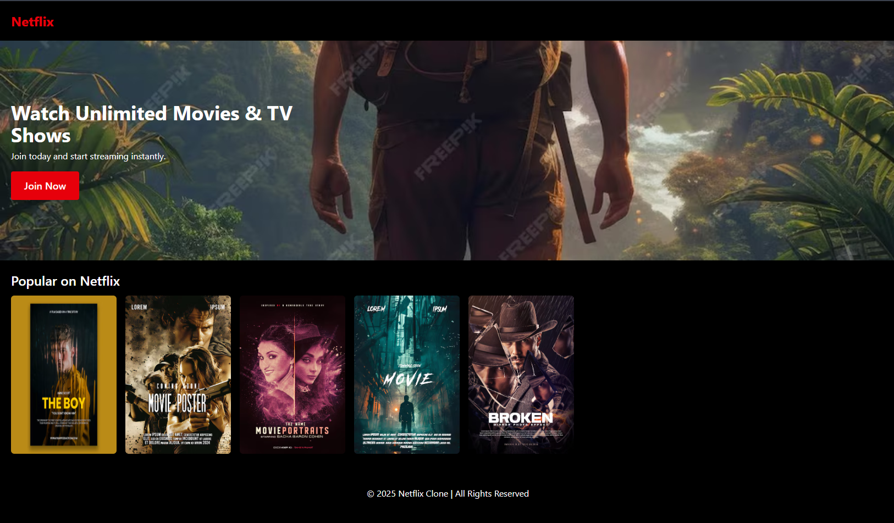

# Netflix Web Clone

A simple Netflix Web Clone built using **React** and **Tailwind CSS**. This project demonstrates a responsive layout with a navbar, hero section, movie carousel, and footer.

## 🚀 Features

- **Responsive Design**: Works well on all screen sizes.
- **Dynamic Movie Thumbnails**: Fetches random images from Unsplash based on different genres.
- **Hero Section with CTA**: Encourages users to join.
- **Smooth Horizontal Scrolling**: Movie list scrolls horizontally for better user experience.

## 🛠 Tech Stack

- **React**: JavaScript library for building UI.
- **Tailwind CSS**: Utility-first CSS framework for styling.

## 📦 Installation & Setup

1. Clone the repository:
   ```sh
   git clone https://github.com/john-apisit/netflix-web-clone.git
   ```

2. Navigate to the project directory:
   ```sh
   cd netflix-web-clone
   ```

3. Install dependencies:
   ```sh
   yarn
   ```

4. Start the development server:
   ```sh
   yarn dev
   ```

5. Open your browser and visit `http://localhost:3000`.

## 📷 Screenshot



## 🤝 Contributing

Feel free to fork the project and submit pull requests to improve it.

## 📜 License

This project is open-source and available under the MIT License.

---

### 🌟 Show some love!
If you like this project, consider giving it a ⭐ on [GitHub](https://github.com/john-apisit/netflix-web-clone)! 😊

